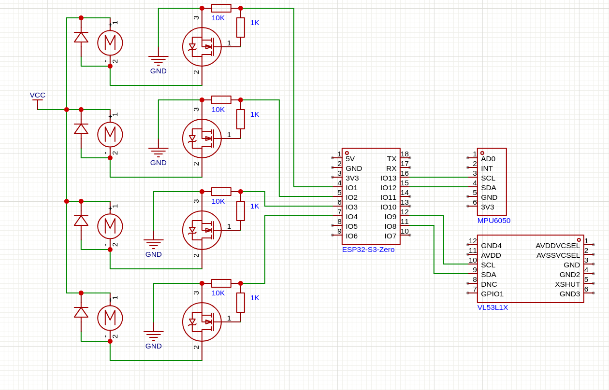
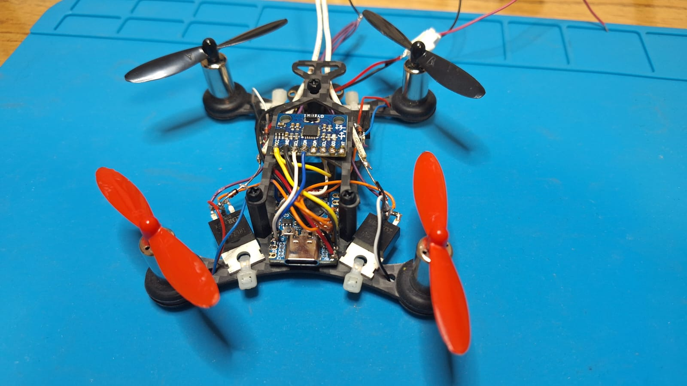
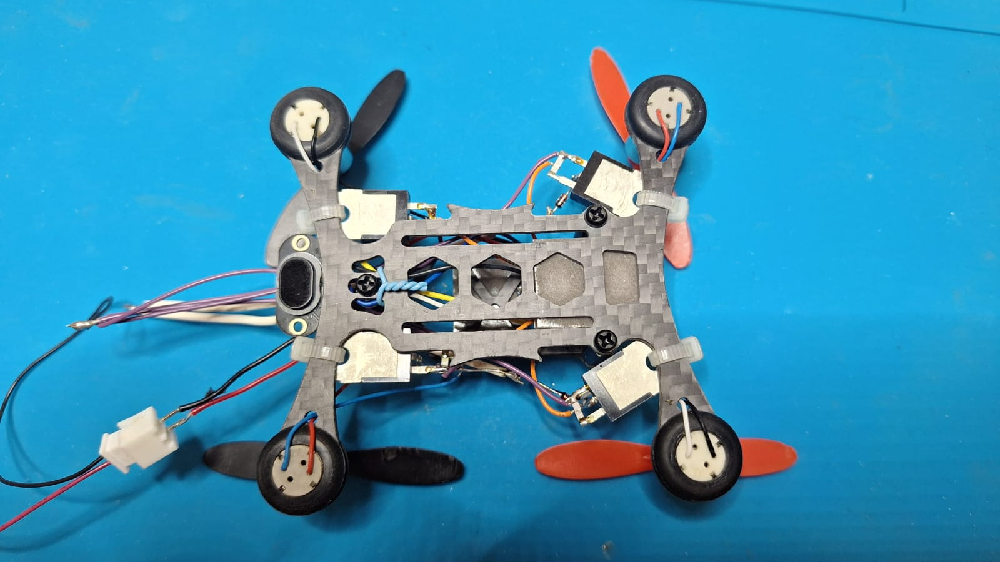

# Drone **Vespa** - Projeto basicamente para estudos.

Versão: ESP-IDF **5.2**

## Componentes Utilizados

- **Microcontrolador:**
  - 1 × ESP32-S3-Zero
- **Sensores:**
  - 1 × MPU6050
  - 1 × TOF400C VL53L1X (3.0–5.0V, 40mA, 940nm IR)
    - *Dead Zone: 0–4 cm*
    - *Distância máxima: 4 metros*
- **Potência e Controle:**
  - 4 × Transistores MOSFET canal N IRLZ44N
  - 4 × Resistores SMD 10K
  - 4 × Resistores SMD 1K
  - 4 × Diodos 1N4148
- **Propulsão:**
  - 4 × Motores 8520 coreless
  - 4 × Hélices 55 mm
- **Alimentação:**
  - 1 × Bateria 1S (3.7V, 480mAh)
- **Estrutura:**
  - 1 × Frame QX95 3"

---

## Disposição dos Motores

```
            Frente
             /\
        M1       M2
      (CW)       (CCW)

        M4       M3
      (CCW)       (CW)
             \/
          Traseira
```

---

## Eixos e Movimentos

- **Z (Throttle / Propulsão)**: Sobe e desce – aumenta ou diminui todos os motores.
- **Z (Yaw / Guinada)**: Rotação no eixo vertical – altera CW e CCW de forma oposta.
- **X (Pitch / Arfagem)**: Inclinação frente/trás – ajusta frente vs. traseira.
- **Y (Roll / Rolagem)**: Inclinação lateral – ajusta esquerda vs. direita.

---

## Ilustração dos Movimentos

```
+-------------- Y
|   A)      B)       C)       D)
|  >  <<   >>  <    >  <<    >>  <
|  << >    <  >>    <  >>    <<  >
|
|   E)      F)       G)       H)
|  >> <<   >  <     >> <<    >  <
|  << >>   <  >     <  >     << >>
X
```

### Ações:

- A) Guinada sentido anti-horário
- B) Guinada sentido horário
- C) Rolagem positiva
- D) Rolagem negativa
- E) Decolagem
- F) Aterrissagem
- G) Arfagem positiva
- H) Arfagem negativa

---

## Relações de Força (Simplificado)

```c
// Força total
Ftotal = F1 + F2 + F3 + F4

// Torque Roll (eixo X)
Troll = (F2 + F3) - (F1 + F4)

// Torque Pitch (eixo Y)
Tpitch = (F1 + F2) - (F3 + F4)

// Torque Yaw (eixo Z)
Tyaw = K * ((F1 + F3) - (F2 + F4))
```

---

## Circuito com Mosfet

**Conexão:**
`Gate (GPIO) → Drain (Motor) → Source (GND)`

**Cor do fio do motor ao Dreno de cada MOSFET:**

- M1: Branco
- M2: Vermelho
- M3: Branco
- M4: Vermelho

### Diagrama Simplificado para um único motor:

```
              +--------------+
              |     (  )     |
              |              |
              ---------------|
             /              /|
            ---------------- |
            |              | |
            |   IRLZ44N    | |
            |              | |
            |              | |
            |  G   D   S   |/
            +--+---+---+--+
               |   |   |
               |   |   +-------------+
               |   |                 |         
               | ( o ) Motor         |
               |   |                 |
               |   O                 |
               |   Vcc Bat+ 3.7V     |
               |                     |
               |                     |
               +--/\/\/\--+--/\/\/\--+
                   1K     |    10K   |
                          |          |
                          |        -----
                          |         ---
                          |          -
                          |          
                          O          
                         PWM recebido do ESP32-S3-Zero em 10KHz, testado em outras frequências, mas teve um bom desempenho em 10KHz
```

---

### Diagrama:



---

### Fotos:



---

## Próximos passos

```text

  - Verificar nível da bateria
  - Avaliar o uso de Wi-Fi para controle ou um módulo LoRa
  - Implementar segurança: em caso de desnível acentuado em Pitch ou Roll, desligar os motores


```

---

## Mapeamento dos Pinos (GPIO)

```text
    Motores:
        M1 (Frente esquerda)......: GPIO 1
        M2 (Frente direita).......: GPIO 2
        M3 (Traseira direita).....: GPIO 3
        M4 (Traseira esquerda)....: GPIO 4

    MPU6050:
        SDA.......................: GPIO 12
        SCL.......................: GPIO 13

    VL53L1X:
        SDA.......................: GPIO 8
        SCL.......................: GPIO 9
```

---

## Preparando o Ambiente ESP-IDF

```bash
idf.py create-project esp32s3
cd vespa
idf.py set-target esp32s3
idf.py create-component -C components baselib
idf.py menuconfig
```

### Configurações feitas no menuconfig:

- `Serial flasher config / Flash size: 4MB`
- `ESP System Settings / CPU frequency: 240 MHz`
  
  ⚠️ *Observação: Atualmente ainda com 160 MHz*

### Adição no `CMakeLists.txt` (na raiz):

```cmake
set(EXTRA_COMPONENT_DIRS /home/mauro/esp/esp-idf-lib/components)
```

---

## Links utilizados:

-  [ESP Drone Drivers (Espressif)](https://docs.espressif.com/projects/espressif-esp-drone/en/latest/drivers.html)
-  [esp-idf-lib (UncleRus)](https://github.com/UncleRus/esp-idf-lib)
-  [ESP32 VL53L1X Interface](https://github.com/revk/ESP32-VL53L1X)
